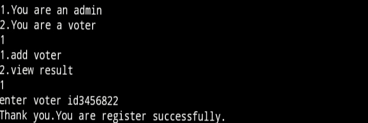
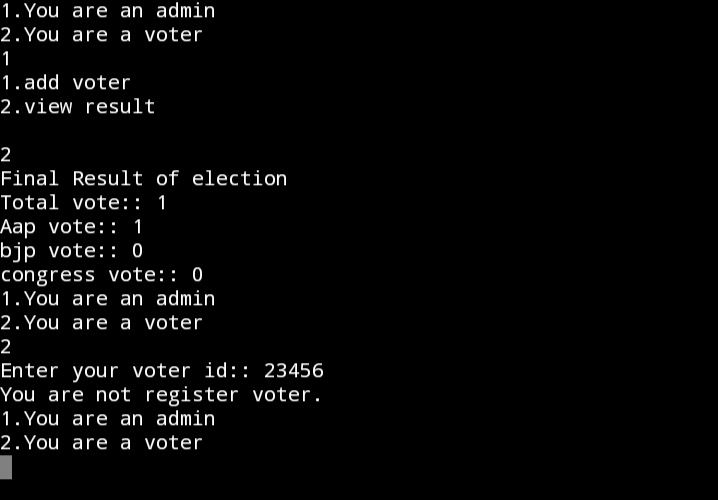
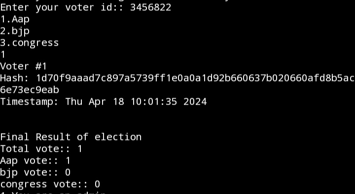

#  PROJECT NAME:: Blockchain-Based Voting System
- An blockchain-based voting system technology leverages the decentralized and immutable nature of blockchain to enhance security, transparency, and trust in the voting process. Each vote is recorded as a transaction on the blockchain, providing a transparent and tamper-proof ledger of all voting activities. Smart contracts can be utilized to automate and enforce voting rules, ensuring accuracy and fairness. 

- Voters are provided with cryptographic keys to securely cast their votes, maintaining anonymity while preventing fraud and manipulation. Blockchain-based online voting systems offer increased resilience against hacking and unauthorized access compared to traditional centralized systems. However, challenges such as scalability, accessibility, and ensuring voter privacy still need to be addressed for widespread adoption.

  
## Prerequisites
- C++ compiler (e.g., g++, clang++)
- OpenSSL(version 1.1.1k) library for SHA256 hashing
- Basics Understanging Of C++ And Blockchain

## Features
- Admin and voter interfaces
- Voter registration system
- Voting system for three parties
- Real-time result tally
- Blockchain implementation for vote tracking


## Use Of Library
 #### ctime
   - In my project,This library is you for getting current time of voting
 #### string 
   - This is used for sting manipulation.
#### openssl
  - This library is used for get hash value.

## Flow Of Program

1. **Start**
- The program begins execution.

2. **Main Menu**
- Prompt: "Are you an admin or a voter?"
- Options:
  - Admin: Go to Admin Menu.
  - Voter: Go to Voter ID Check.
  - Invalid input: Notify and repeat Main Menu.

3. **Admin Menu**
- Prompt: "Would you like to add a voter or view results?"
- Options:
  - Add Voter: Go to Add Voter.
  - View Results: Go to View Results.
  - Invalid input: Notify and repeat Admin Menu.

4. **Add Voter**
- Action: Admin enters voter ID to register.
- Outcome:
  - Success: Confirm registration and return to Main Menu.
  - Failure: Notify and end process.

5. **View Results**
- Action: Display election results.
- Outcome: Return to Main Menu.

6. **Voter ID Check**
- Prompt: "Enter your voter ID."
- Outcome:
  - ID found: Go to Voting.
  - ID not found: Notify and return to Main Menu.

7. **Voting**
- Prompt: "Choose a party to vote for."
- Options:
  - Valid choice: Increment vote count and update blockchain.
  - Invalid choice: Notify and ask to vote again.

8. **Blockchain Update**
- Action: Add new block with vote data.
- Outcome: Display blockchain and return to Main Menu.

9. **End**
- The program execution ends.
    
## Install G++ In Ubuntu
  - Step 1
    ```
    sudo apt update
    ```
    
   - Step 2 
   
      ```
      sudo apt install g++
      ```
## Install Openssl In Ubantu
### Step 1 (Update system and install dependencies)
- Update your system
```sh
sudo apt update && sudo apt upgrade
```
- Install dependencies
```bash
sudo apt install build-essential checkinstall zlib1g-dev -y
```
### Step 2 (Download OpenSSL)
- Set path where you have to install
```
cd /usr/local/src/
```
- Download openssl library
```bash
wget https://www.openssl.org/source/openssl-1.1.1k.tar.gz
```
- Untar library
```bash
tar -xf openssl-1.1.1k.tar.gz
```
- Go inside the library folder
```bash
cd openssl-1.1.1k.tar.gz
```
### Step 3 (Install and compile OpenSSL)
- Configure the build settings
```bash
./config --prefix=/usr/local/ssl --openssldir=/usr/local/ssl shared zlib
```
- Build the package:
```bash
make
```
- Run tests (optional but recommended)
```bash
make test
```
- Install OpenSSL:
```sh
make install
```
**By default this will install to /usr/local/bin, /usr/local/lib etc. Use --prefix option to customize.**

## Configure link libraries
**Configure the shared libraries for OpenSSL. The new OpenSSL binary will load library files from the '/usr/local/ssl/lib' directory.**
- open openssl file
```sh
cd /etc/ld.so.conf.d/
nano openssl-1.1.1k.conf
```
**Add the following line to the conf file and save.**
```sh
/usr/local/ssl/lib
```
**Reload the dynamic link.**
```sh
sudo ldconfig -v
```
- check the openssl version.
```sh
openssl version
```
 

## Installation
1. Clone the repository:
```sh
git clone https://github.com/16ratneshkumar/blockchain-voting-system.git
```

2. Navigate to the cloned directory:
```sh
cd blockchain-voting-system
```

3. Compile the program:
```sh
g++ -o voting_system project.cpp -lssl -lcrypto
```
4. Run the program:
```sh
./voting_system
```
## Function or class and their work
+  **Block**: Represents a single block in the blockchain.
+  **Blockchain**: Manages the chain of blocks and includes methods to add blocks and print the blockchain.
+  **checkvoter**: Checks if a voter is registered in the system.
+  **vote**: Handles the voting process.
+  **viewresult**: Displays the final results of the election.
+  **addvoter**: Adds a new voter to the registry.
+  **main**: The entry point of the program, providing the user interface.


## Output of My project
- Step 1
  - Select You Are Voter Or Admin

    
- Step 2
  - If You Are Admin . You Can Add New Voter And View The Result Of Election.

     
     
- Step 3
  - If You Are Voter. You Can Vote And Also You Can Able To See Result Of Election.
  
    

## Usage
**The program has two main user roles: admin and voter.**
- As an **admin**, you can add voters and view results.
- As a **voter**, you can cast your vote using your voter ID and also view results.


