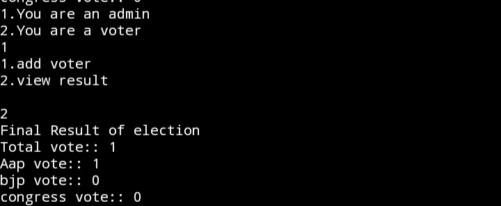
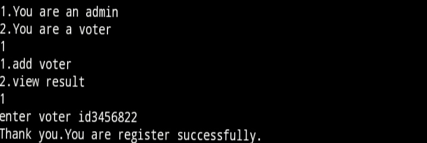
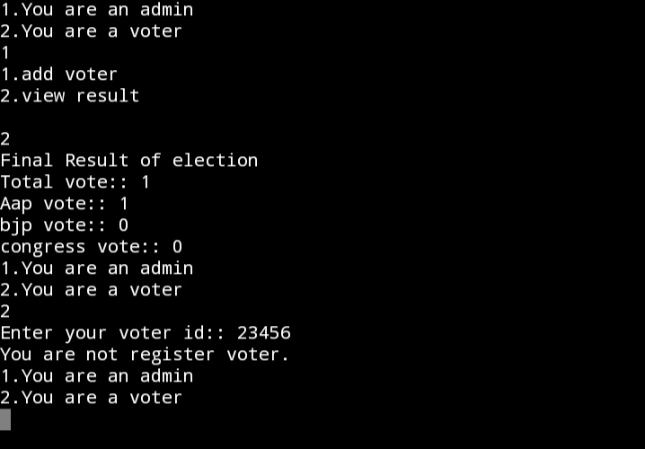
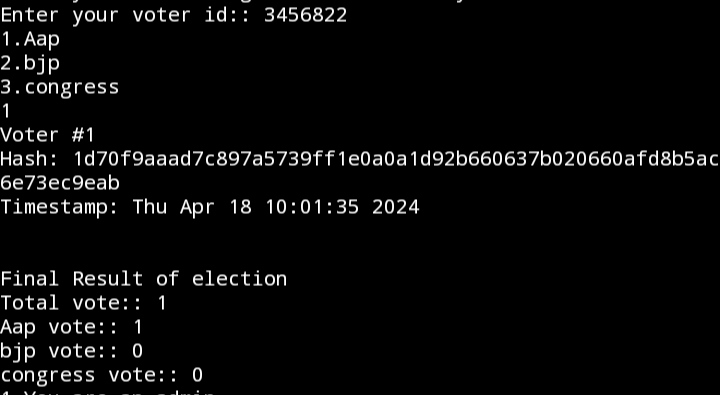

#  PROJECT NAME:: Online Voting System Using Blockchain
- An online voting system using blockchain technology leverages the decentralized and immutable nature of blockchain to enhance security, transparency, and trust in the voting process. Each vote is recorded as a transaction on the blockchain, providing a transparent and tamper-proof ledger of all voting activities. Smart contracts can be utilized to automate and enforce voting rules, ensuring accuracy and fairness. 

- Voters are provided with cryptographic keys to securely cast their votes, maintaining anonymity while preventing fraud and manipulation. Blockchain-based online voting systems offer increased resilience against hacking and unauthorized access compared to traditional centralized systems. However, challenges such as scalability, accessibility, and ensuring voter privacy still need to be addressed for widespread adoption.

## Prerequisite Of This Project
  + Basics Understanging Of C++ And Blockchain
  + C Plus Plus Compile (G++)
  + Library
      - ctime
      - string
      - openssl
## Use Of Library
 #### ctime
   - In my project,This library is you for getting current time of voting
 #### string 
   - This is used for sting manipulation.
#### openssl
  - This library is used for get hash value.
## Install G++ In Ubuntu
  - Step 1
    ```
    sudo apt update
    ```
    
   - Step 2 
   
      ```
      sudo apt install g++
      ```
## Install Openssl In Ubantu
- Step 1
  ```
  sudo apt update
  ```
- Step 2
  ```
  sudo apt install openssl
  ```

  ## Install G++ In Window
   - [Go Through This Link](https://sourceforge.net/projects/gcc-win64/)
 
 
## Overview Of My Project
  + In This Project I Am Use File Handing To Store Data You Can Also Do This Same Task With Databases.
  + I Use Openssl Libray For Hashing Value.

- Step 1
  - Select You Are Voter Or Admin
    
    
- Step 2
  - If You Are Admin . You Can Add New Voter And View The Result Of Election.
     
     
- Step 3
  - If You Are Voter. You Can Vote And Also You Can Able To See Result Of Election.
    


## How To Run Cpp Project In Terminal
- Step 1
    - First You Have to compile your code using cmd::
      ```
      g++ <projectname> -o <compilefilename> -<libraryname>
      ```
      - In my case it is
        ```
        g++ project.cpp -o project -openssl
        ```

- Step 2
  - Then We Have TO Run Compile Project
    ```
    ./project
    ```
 

